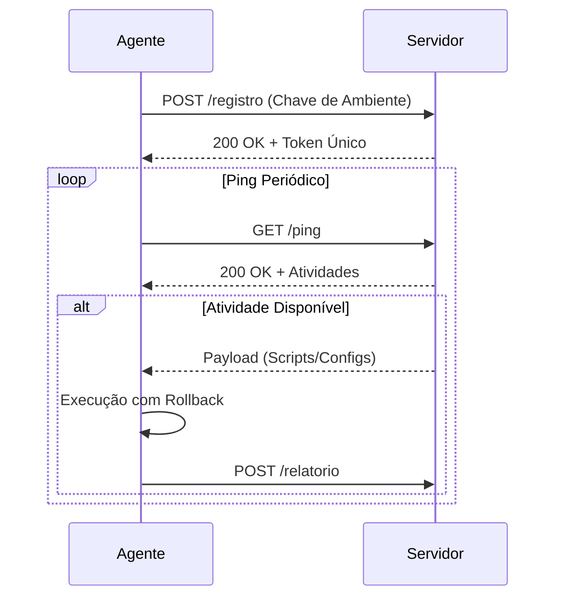
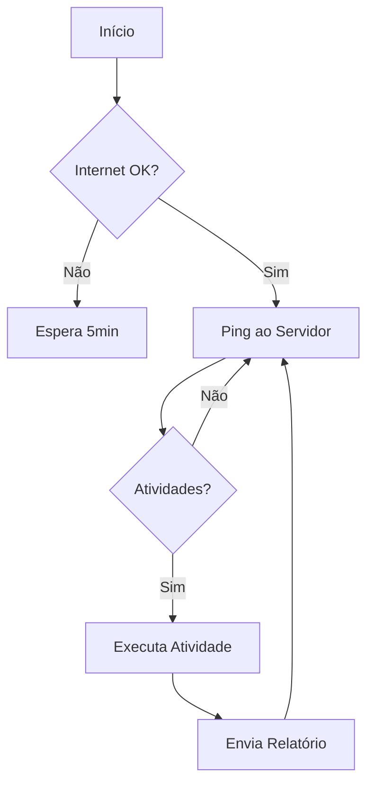

# Guardião
  
**Plataforma Brasileira de CyberSec de Código Aberto**

**Modelo Purple Team Integrado**

**Scanners Passivos/Ativos | Monitoramento | Resposta Ativa**

> ⚠️ **Aviso de Segurança**: Este projeto está em desenvolvimento ativo e contém vulnerabilidades conhecidas. Seu uso é recomendado **apenas para testes em ambientes controlados**, não para produção. Contribuições são bem-vindas para fortalecer a segurança da plataforma.

---

## 🌐 Visão Geral

O Guardião é uma plataforma integrada de gestão de riscos para homelabs, combinando scanners de segurança, monitoramento proativo e resposta automatizada em uma stack leve. Projetado com foco em **automação purple team**, permite tanto a identificação de vulnerabilidades (red team) quanto a defesa automatizada (blue team).  

---

## 🔑 Funcionalidades Principais

| **Categoria** | **Detalhes** |

|----------------------|-----------------------------------------------------------------------------|

| **Detecção Ativa**  | Scans com Trivy, Nmap, OSSEC, Nuclei, OpenVAS |
| **Detecção Passiva**  | Zeek |
| **Monitoramento** | Análise de logs em tempo real via ZincSearch |

| **Resposta** | Execução remota de patches, reinicialização de serviços e scripts custom |

| **Análise** | Correlação de eventos e modelagem de vetores de ataque (Em breve) |

| **Automação** | Workflows para instalação de software, updates e mitigação de vulnerabilidades |

  

---

  

## 🛠️ Tecnologias Utilizadas

- **Backend**: Python + Flask (API RESTful)
- **Dados**: MariaDB
- **Agentes**: Serviços escritos em Python com comunicação TLS
- **Monitoramento**: OSSEC + ZincSearch (alternativa levinha ao Elasticsearch)
- **Scanners**: Trivy (vulnerabilidades), Nuclei (web apps), OpenVAS (rede)
- **Orquestração**: Docker Compose 

  

---

  

## 📊 Arquitetura e Fluxos Críticos

  

### Diagrama de Comunicação Agente-Servidor



**Explicação**:

1.  **Registro Inicial**: Autenticação assimétrica com chave pré-compartilhada

2.  **Heartbeat**: Verificação periódica de atividades pendentes

3.  **Execução Segura**: Sandboxing para atividades críticas e rollback automático

  

---

  

### Fluxo de Atividades do Agente



**Funcionamento**:

-  **Resiliência**: Tolerância a falhas de conexão

-  **Modularidade**: Atividades plugáveis (scans, updates, scripts)

-  **Auditoria**: Logs criptografados de todas as operações

---

## 🗺️ Roadmap

| **Status**       | **Funcionalidades**                                                                 |
|------------------|------------------------------------------------------------------------------------|
| ✅ **Concluído** | 🐧 **Agente Linux**<br>• 🚀 API REST<br>• 🤖 Autodeploy<br><br>🖥️ **Interface Web**<br>• 📊 Dashboard Flask<br>• 🔍 Visualizador de CVEs<br><br>🔎 **Scanners**<br>• 🐳 Trivy integrado<br>• 📦 Detecção de pacotes |
| 🛠️ **Em Progresso** | 🛡️ **OSSEC**<br>• ⚙️ Autoconfig<br>• 📜 Regras custom<br><br>🐋 **Docker**<br>• 🧩 Compose<br>• 📁 YAML management<br><br>🤖 **Automação**<br>• ↩️ Rollback<br>• 🔑 Verificação crypto |
| 🧭 **Planejado** | 🌐 **Multiplataforma**<br>• 🪟 Agente Windows<br>• 🖥️ ARM Support<br><br>📡 **Appliance**<br>• 🕵️♂️ Zeek/Nmap<br>• 🗺️ Netmapper<br><br>🧠 **IA**<br>• ⚔️ MITRE ATT&CK<br>• 🔮 Priorização inteligente<br>• 🔗 Correlação de logs |

---

  

## ⚡ Como Usar

1.  **Servidor**:

```

git clone https://github.com/Pasch0/guardiao.git

cd guardiao && docker compose up -d

```

2.  **Agente Linux**:

```

curl -s http://guardiao/install.sh | bash 

```

  

---

  

## 🤝 Contribuições

-  **Reporte Vulnerabilidades**: Issues com tag `security`

-  **Novas Features**: Pull requests com documentação detalhada

-  **Testes**: Ambientes controlados com diferentes distros Linux

  

---

  

## 📜 Licença

MIT License - Consulte `LICENSE.md` para detalhes.

  

---

  

## 🌟 Diferenciais

-  **Leveza**: Consumo mínimo de recursos (roda até no seu Raspberry Pi)

-  **Brasileiro**: Documentação e suporte em Português

-  **Extensível**: Python friendly, não precisa saber muito de python pra adicionar novas features
- **Democrático**: Código aberto, sem uso de APIs proprietárias, e roda em Docker. Literalmente qualquer pessoa pode testar em casa.

  
> "Segurança acessível para laboratórios e pequenas redes - sem complexidade corporativa."

---

🔗 **Links Úteis**:

- [Docs de Instalação](docs/instalacao.md)

- [Guia de Contribuição](CONTRIBUTING.md)

- [Política de Segurança](SECURITY.md)

